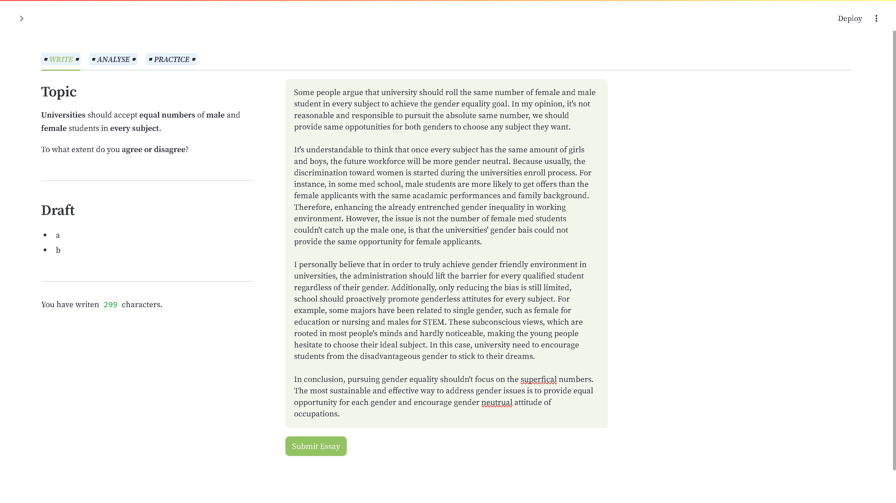
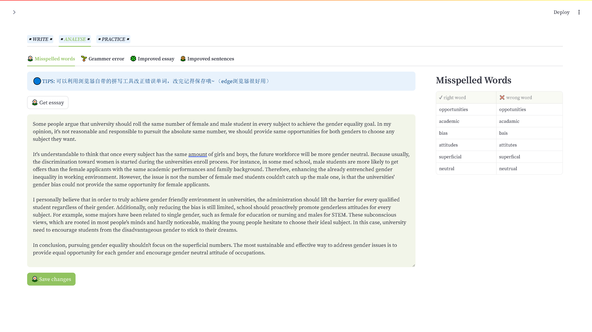
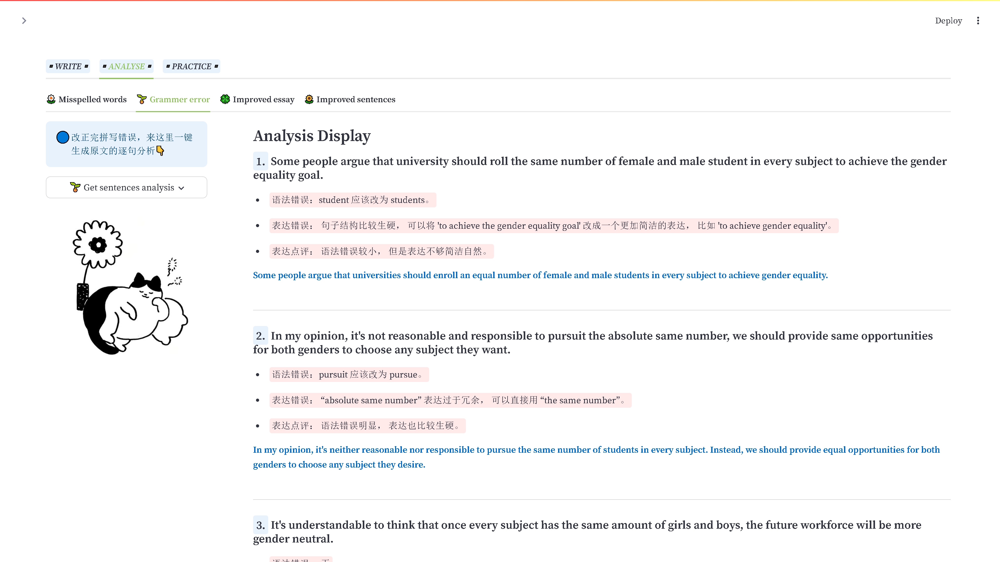
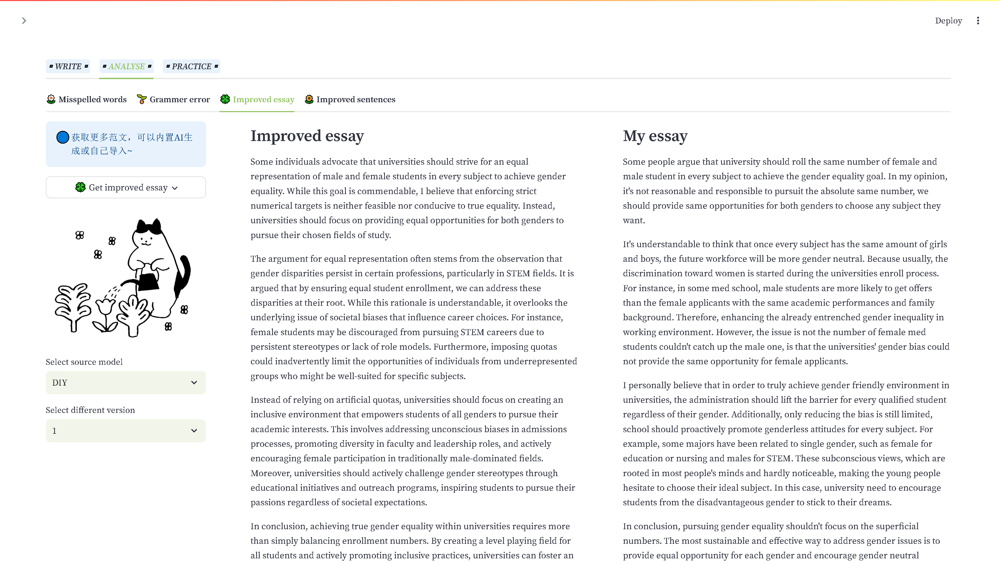
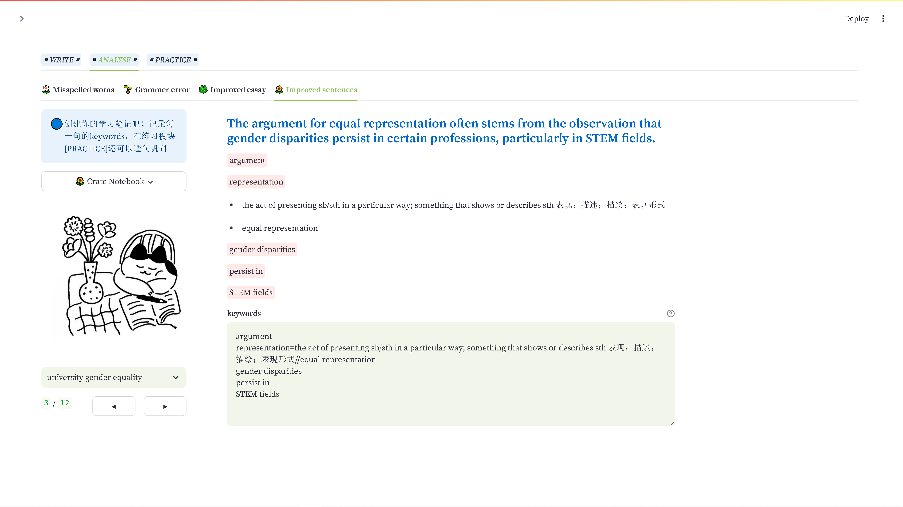
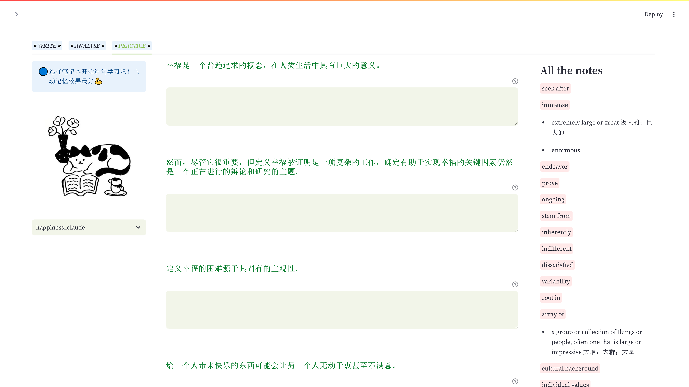
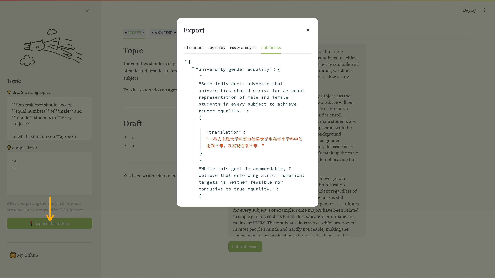

# 雅思写作助手
为了省去写作中在笔记软件和AI应用中反复切换的麻烦，我试着写了一个集合写作、分析和练习为一体的小web应用。
- 使用streamlit框架
- AI目前可以调用免费的Gemini和便宜的国产deepseek，同时提供DIY导入答案（你可以将prompt拷贝到其他AI应用里，将答案提交后也可以使用内部功能）

## 项目特点
1. **沉浸式写作体验**：页面极简，只显示topic, draft 和词数。
2. **文章全维度分析功能**：
    - **拼错单词检查与总结**：可使用浏览器自带拼写检查功能改正后，一键获取拼写错误单词
    - **逐句语法分析与点评**：支持DIY分析
    - **范文生成便捷且可控**：支持DIY范文，可进行多篇范文生成与查看
    - **范文学习和笔记记录**：为范文创建学习笔记，逐句精读做笔记
3. **范文造句练习**：对照中文翻译和笔记，进行重新造句练习，加强记忆
4. **所有分析均可导出**：范文笔记以json格式导出，再次复习可以重新在笔记区复制添加
---
### 🔵 3大板块：写作-分析-练习

### ⭐写作板块：

### ⭐分析板块

### ⭐练习板块

### ⭐导出区域

---
## **使用说明**
### **该项目还是不太成熟，存在一些bug，推荐只供学习交流使用😁**
**API使用：**
- 使用内置AI功能，必须要有gemini和deepseek的APIKEY.
    - 如果你没有：
        - gemini前往这里：https://aistudio.google.com/app/apikey
    
        - deepseek前往这里：https://platform.deepseek.com/api_keys
    
    - 如果你已经获取：请在根目录下创建.env.local文件，并将APIKEY保存到文件里面

        ~~~
        API_KEY="your gemini key"
        DEEPSEEK_KRY="your deepseek key"
        ~~~
- 当然你也可以增加自己的API

**笔记本创建说明：**
1. 获取要精度的英文文本
2. 获取文本后，在下方会自动将文本分割为句子
3. 可以利用浏览器的翻译功能，将英文句子翻译为中文（或者其他翻译插件）
4. 将翻译的中文句子拷贝到翻译区（要保证英文句子和翻译句子是一一匹配的）

## **题外**
学习Python这两个月来尝试做了很多小项目，这是唯一还算完整的。虽然它功能有限，太多想法比如**使用数据库储存、单词听写、笔记漫游和AI智能分类**等还未实现，但已经对我写作有很大帮助了。（当然也许敲代码所花的时间已经够我写不少作文了👻）

也许未来我还会继续完善开发，使它可以满足更多写作练习需求（不仅限于英语学习）💪
